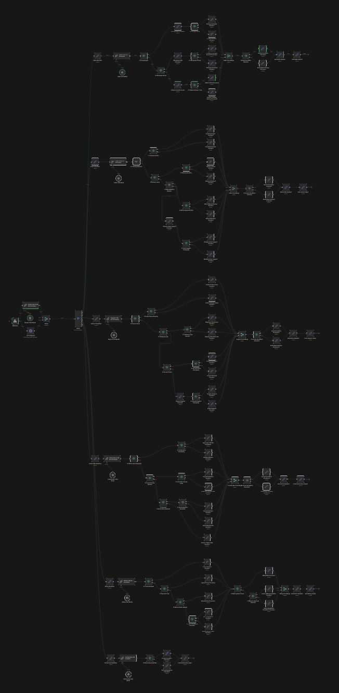
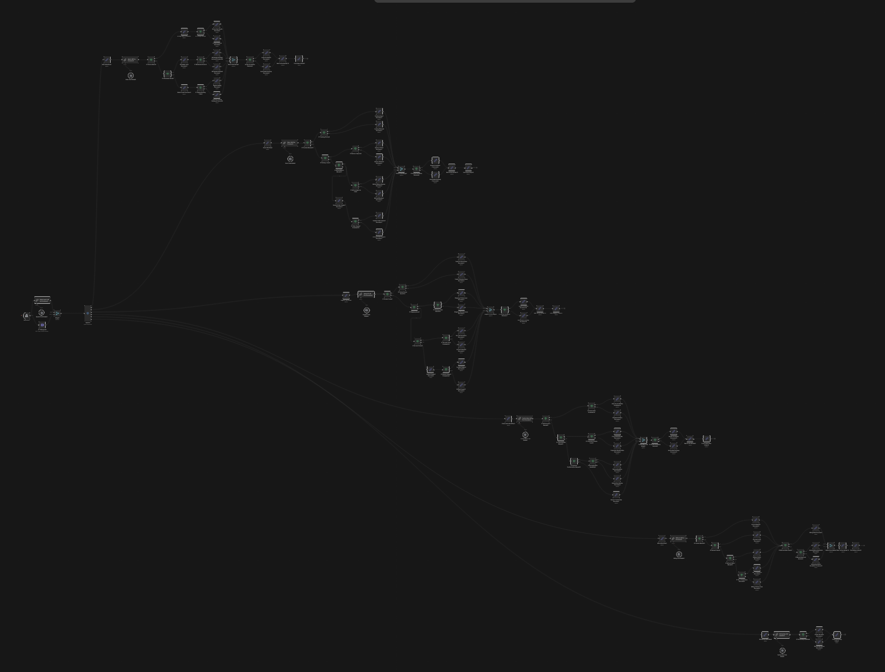
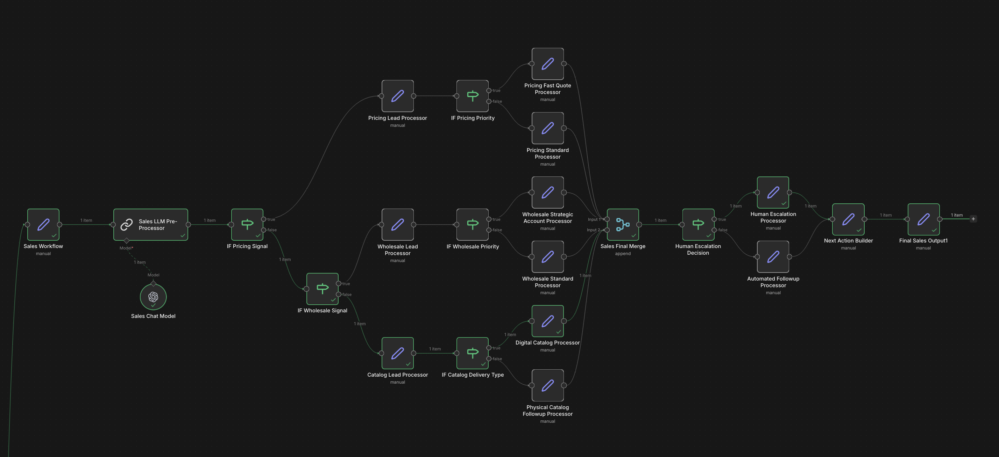
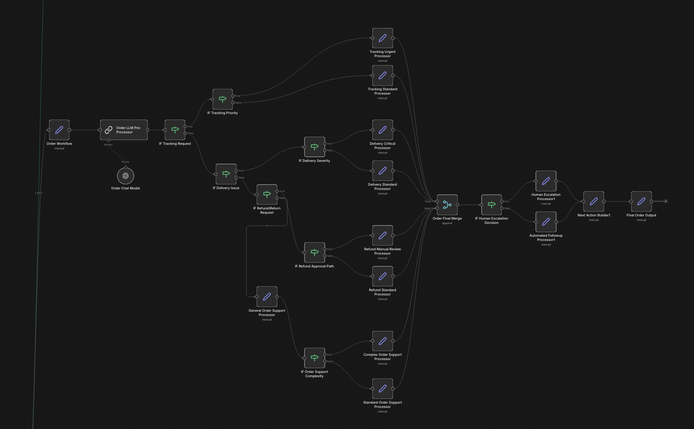
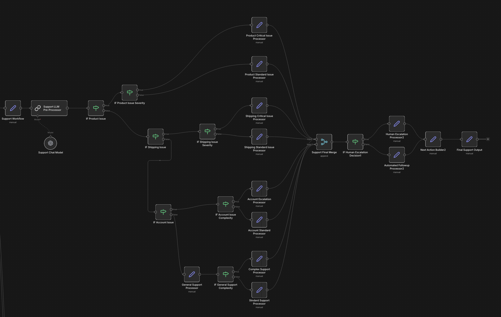
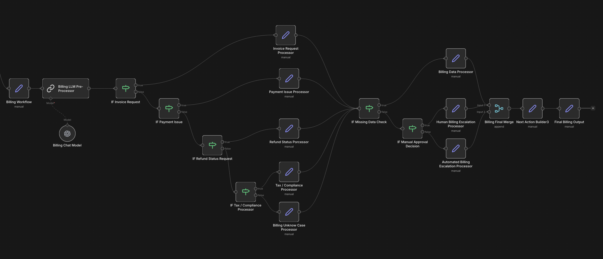
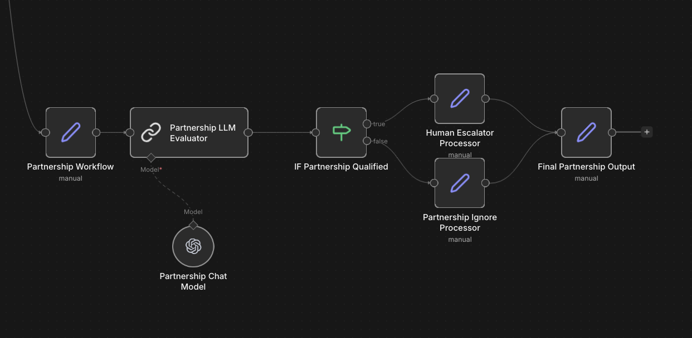
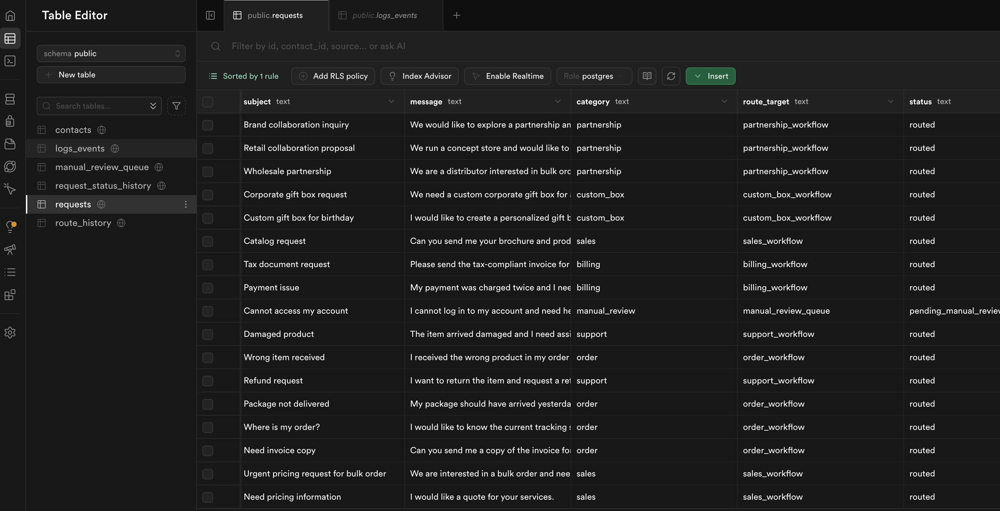
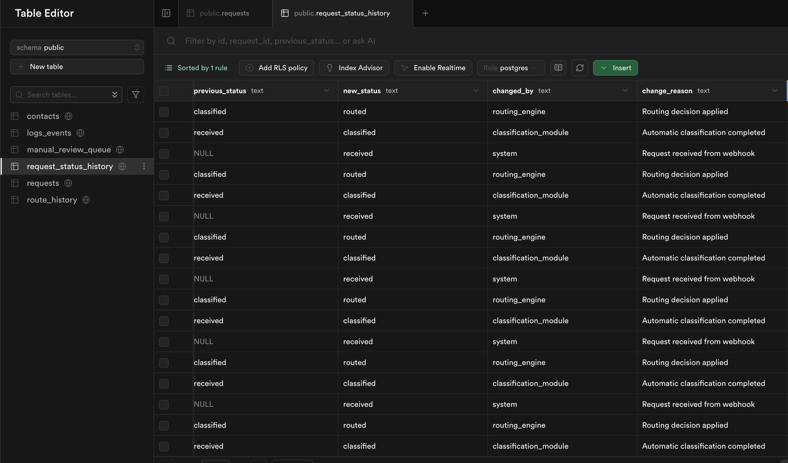
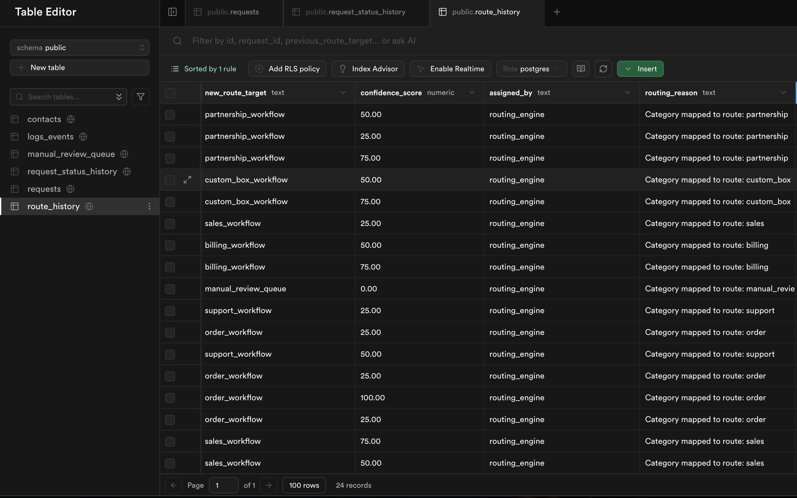

# Adaptive Workflow Routing Engine

Operational routing system designed to classify inbound requests, route them to the correct specialized workflow, track lifecycle states, and preserve full operational traceability through a structured database layer.

*Multi-branch workflow engine built to reduce manual triage work, improve routing consistency, and combine AI interpretation with deterministic operational logic.*

Adaptive Workflow Routing Engine is a focused operational system created to simplify a recurring business problem: receiving mixed inbound requests and directing them to the right processing flow.

The project does not rely on a single generic automation chain.  
Instead, it uses a central routing engine that interprets incoming requests, selects the correct workflow branch, applies escalation logic when needed, and stores the full request lifecycle inside Supabase.

## What it does

- Receives inbound requests from external sources
- Uses AI preprocessing to normalize and interpret messages
- Classifies requests into operational categories
- Routes each request to the correct workflow branch
- Applies branch-specific logic for processing
- Detects cases requiring human escalation
- Tracks routing decisions and status transitions in the database
- Produces final structured outputs for downstream handling

## System structure

- **Inbound intake layer**  
  Receives raw requests through a central entry point.

- **AI preprocessing layer**  
  Uses OpenAI models to normalize message content and improve routing accuracy.

- **Routing engine layer**  
  Selects the correct workflow branch based on request intent and business logic.

- **Workflow execution layer**  
  Dedicated workflows process each request category independently.

- **Escalation layer**  
  Detects requests requiring manual review or human handling.

- **Persistence layer**  
  Supabase stores requests, routing history, and lifecycle events.

## System flow

The system operates as a modular inbound-request orchestration workflow:

1. A new request enters the intake layer.
2. AI preprocessing interprets and structures the raw message.
3. The routing engine determines the correct workflow destination.
4. The request is sent to the corresponding specialized workflow.
5. Branch-specific logic processes the request.
6. Escalation rules determine whether human intervention is required.
7. A final action output is generated.
8. Supabase stores request metadata, status history, and route history.
9. Logs preserve operational traceability.

## Architecture diagrams

### Vertical Architecture View

### Horizontal Architecture View

## Workflow branches

The system uses dedicated workflows for different request types.

### Sales Workflow

Handles:

- pricing inquiries
- catalog requests
- wholesale interest
- sales escalation logic

### Order Workflow

Handles:

- tracking requests
- delivery issues
- refund / return requests
- order assistance

### Support Workflow

Handles:

- product issues
- account problems
- shipping support
- general assistance

### Billing Workflow

Handles:

- invoices
- payment issues
- refund status requests
- tax / compliance cases

### Custom Box Workflow

Handles:

- personalized product requests
- gift requests
- custom order scenarios

### Partnership Workflow

Handles:

- collaboration proposals
- reseller interest
- strategic partnership evaluation

## Operational proof

This system was designed as a real routing and operations workflow, not as a conceptual prototype.  
Requests successfully pass through classification, routing, workflow execution, escalation logic, and persistence layers.

The architecture demonstrates a functioning inbound operations engine capable of handling multiple request categories through modular workflows.

## Input / Output

**Input**

- inbound customer requests
- email / form / external source messages
- raw text subject and message content

**Intermediate outputs**

- AI-normalized request content
- routing classification
- selected workflow destination
- branch execution states
- escalation decisions
- logs and lifecycle events

**Final output**

- processed request outcome
- correct workflow routing
- manual review queue when required
- full database traceability

## Component roles

- **Webhook Intake**  
  Receives incoming requests.

- **Global Input LLM Pre-Processor**  
  Structures and interprets raw inbound messages.

- **Routing Engine**  
  Directs requests to the correct workflow branch.

- **Branch Workflows**  
  Apply specialized logic per request category.

- **Human Escalation Layer**  
  Detects cases requiring manual intervention.

- **Supabase Database**  
  Stores requests, route history, and status history.

- **Python Modules**  
  Support orchestration and custom backend logic.

## Database layer

### Requests Table

Stores:

- request content
- category
- route target
- status

### Requests Status History

Tracks lifecycle states such as:

- received
- classified
- routed
- escalated
- completed

### Route History

Tracks routing decisions and workflow destinations.

## Why this architecture exists

Many inbound operations environments receive mixed requests that require different handling paths.

Without a routing layer, teams waste time manually reading, categorizing, and redirecting messages.  
This system exists to automate that triage process while preserving control, escalation capability, and full visibility.

By separating responsibilities into workflow branches, the engine becomes easier to scale, supervise, and improve over time.

## Real-world constraints

This project was designed around practical operational constraints, including:

- mixed inbound request categories
- need for fast routing decisions
- partial automation with human fallback
- request lifecycle visibility
- database traceability
- modular expansion over time

Because of these constraints, the architecture prioritizes reliability, clarity, and operational usefulness over unnecessary complexity.

## Project structure

The repository is organized as a layered workflow-routing system, with separate components for intake, AI preprocessing, routing, branch workflows, escalation logic, and persistence.

The structure reflects the workflow described above: routing logic, execution logic, and data tracking remain separated so the system can scale cleanly.

## Why it matters

Many businesses lose time handling inbound requests manually.  
This project demonstrates how a modular routing engine can classify requests, send them to the correct operational flow, and preserve visibility across the full lifecycle.

Its value lies in reducing triage workload, improving consistency, and enabling scalable operations.

## Operational logic

Adaptive Workflow Routing Engine is built around a hybrid model:

- AI interprets requests
- deterministic workflows process them
- escalation rules protect edge cases
- database history preserves traceability

This makes it a strong example of intelligent operational augmentation rather than blind automation.

## Status

Completed prototype with functioning routing engine, modular workflows, database persistence, and successful end-to-end execution.

## Scope

This project is designed as a focused workflow-routing system for inbound operations handling.  
It is not intended as a generic chatbot or one-size-fits-all automation tool, but as a modular operational engine built around classification, routing, escalation, and traceability.
